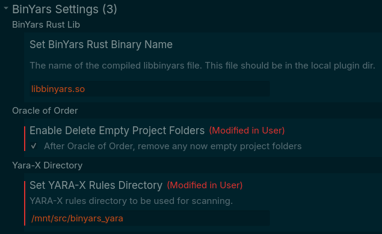
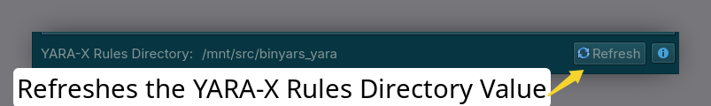

## Description

BinYars is a Binary Ninja Plugin which intergrates YARA-X into Binary Ninja - 2 of my favorate tools.

## Manual Installation

See: [BinYars](https://github.com/xorhex/BinYars)

This plugin comes in 2 parts.

## Components

### Rust Component

This handles all of the Yara-X scanning and the Binary Ninja folder sorting and compilation of the Yara-X rules.

Precompiled binaries are included in the release for:

- Windows x64

- Linux x64

- Mac arm64

### Python Component

This component contains the UI for the Sidebar Widget as it's easier to write Qt Widgets in Python versus Rust (didn't even try).  It make calls to the Rust component to perform scanning and other YARA-X things.  The sidebar is also responsible for displaying the results and an embedded rule editor.

## Post Installation

Set the value for **<u>"Set YARA-X Rules Directory"</u>** to a folder that contains the list of yara files to use for scanning.  The files must have the extension *.yar* to be found.

### Settings



## Features

### Project Level

*Note: This component requires Binary Ninja Commerical version or higher, as projects are not supported in other versions.*

These are all found in the right click menu in the project view.

- Brew (Compile)
  
  - Compiles all of the rules found in the `Yara-X Directory`

- Oracle of Order (Scan + Sort)
  
  - **WARNING**: *This will reorganize the Binary Ninja Project folder structure and files, proceed with caution!*
  
  - **DISCLAIMER**: *This will open each bndb file to get the corrisponding project binary id.  The bndb files are loaded using `FileMetadata::new().open_database_for_configuration()`. According to Vector35, this will _not_ modify any analysis but it may trigger a schema version update.  All that said, I use this feature all of the time, but just be aware that it may modify the bndb file.*
  
  - Runs all of the compiled rules against all of the files in a project and then sorts them into folders based upon the metadata in the rule. Also makes the scan data available in the file's project description.
  
  - Recommend enabling `Delete Empty Project Folders` when using this feature.
  
  - Will save the scan results to the Binary Ninja's project metadata.
  
  - [BinYarsScanSort.webm](https://github.com/user-attachments/assets/f2706e3e-6ed2-4a3b-be7f-75ee3be4b013)

- Scanning Sage (Scan Only)
  
  - Runs all of the compiled rules against all of the files in the project. The results are avaliable in the description and can be viewed at the file level using the BinYars sidebar widget.

### File Level

*Note: Works with Binary Ninja Personal and higher.*

- Compile Rules
  
  - Compiles all of the rule found in the `Yara-X Directory`
    
    - Found under `Plugins` -> `BinYars` -> `Compile Rules`

- Sidebar Widget (defaults to the right side)
  
  - [binyars_sidebarwidget.webm](https://github.com/user-attachments/assets/5627adb1-fd4e-4108-833e-4955d0399585)
  
  - View scan results
  
  - - .png)
    
    - Can click through the string matches to where they are found in the binary
      
      - This behavior simply calls `bv.get_address_for_data_offset`; so to ensure this feature works as expected, test using this snippet in the integrated Python console.
      
      - Also, sometimes the Binary View must be in linear view for this to work.
  
  - Scan the file
    
    - The Rescan button on the Scan Results tab will save the scan results to the bndb's metadata section.
  
  - Create / Edit / Format Yara-X rules
    
    - Comes with a crude, but mostly functioning editor.
    
    - .png)
    
    - 
  
  - Other
    
    - 

## Yara-X Rules

### Meta Section

BinYars uses 3 Meta fields.

**Note**: All field names are case insensitive.

#### BNFolder

This is the folder name to assign all of the matches to in Binary Ninja's Project View

#### Description

The rule description to render inside of Binary Ninja.  

#### BNSettings

##### Control String Rendering in the UI

Rendering of all the string matches in the UI can be restricted via settings set in the BNSettings meta field. By default all string matches are rendered in the UI; however, sometimes this is not desired.

**Disable All String Rendering**

`BNSettings = "!sr"`

Think of `sr` as short for String Rendering.

**Disable Just One String From Being Rendered**

`BNSettings = "!sr:<$string_name>"` 

Multiple string rendering can be disabled using this, just seperate each setting with a `|` inside the `bnsettings` meta field.

`BNSettings = "!sr:<$string_name>|!sr:<$string_name>"`

### Console Module

The plugin can surface `console.[log|hex]` messages, but the strings must match this format for them to be picked up.

```
console.hex("BN|rule:<rule name>|<ValueName>: ", <value>)
```

All console messages are parsed as follows:

- Must start with `BN|`; will be ignored if not

- Must have a `rule:<rule name>`entry between a set of `|`
  
  - This is due to the fact that the callback for capturing Yara-X console messages does not pass in the rule name that triggered the console message.
  
  - This is needed to map the console message to the rule.

- `<ValueName>` can be anything provided it does not include `|` as the code splits on those characters.
  
  - The value name and the value are rendered in the UI.  To group mulitple console call values together in the BinYars sidebar widget, use `.` to bind them  together.
    
    - For example, to render a both offset and size under Shellcode in the UI do this:
      
      - `("BN|rule:my_shellcode_rule|Shellcode.Offset: ", shellcode_offset)`
      
      - `("BN|rule:my_shellcode_rule|Shellcode.Length: ", shellcode_size)`
      
      - Both of these values will be combined into 1 entry in the sidebar widget under Shellcode
  
  - The value name **Offset** is special. When used, it will make the entry in the sidebar widget interactive; so when clicked upon, it will goto that location in the binary.
  
  - The value name **Length** is also special.  When used in combination with **Offset**, the results displayed will include the bytes from the `offset` to the `offset + length`.

**Example Rule**

```
import "pe"
import "console"

rule this_rule_has_been_taken {
    meta:
        bnfolder = "Secret Sauce"
        description = "This rule captures a very particular set of bytes, bytes I have acquired over a very long career. Bytes that make me a nightmare for binaries like you."
    strings:
        $very_particular_set_of_bytes = { ?? ?? ?? ?? ?? ?? ?? }
    condition:
        pe.is_pe and
        with
            offset = uint32(@very_particular_set_of_bytes[#very_particular_set_of_bytes] + 1),
            size = uint16(@very_particular_set_of_bytes[#very_particular_set_of_bytes] + !very_particular_set_of_bytes) : (
                console.hex("BN|rule:this_rule_has_been_taken|Taken.Offset: ", offset)
                and console.hex("BN|rule:this_rule_has_been_taken|Taken.Length: ", size)
        )
}
```

## TODOs

- Determine if the current view is part of a project, if so - do not register (or maybe just invalidate it) the Compile Rules plugin option.  This command is needed for instances of Binary Ninja that do not support projects.  
  
  - So for now there are 2 commands that do the same thing: 
    
    - Brew (Compile)
    
    - Compile Rules

## Disclaimers

In order to complete this in a timely fashion amoungst other things in life, *vide coding* was used for significate portions of this plugin. I mean, who wants to hand craft Python Qt widgets or is maybe a Rust n00b. That said, I've done my best to try and make sure there are no adverse side effects with this plugin; however, proceed to use at your own risk - O' and [MIT License](./LICENSE)
